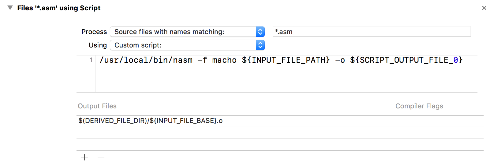

## Using NASM on macOS and Windows

I was trying to build a compiler, as a course project in Compiler Technology course in Beihang University.
I decided to use x86 as my destination code architecture.
However there are 2 more steps to take before the x86 code can be executed.
Here is a what I have tried and I hope it will help you.

The assembly code has to be "assembled" first, with a program called assembler.
The assembler will produce a program called object file.
Each source assembly file will be assembled to an object file.
All the object files are then "linked" by a program called linker.
`lld` might be used on macOS and `mingw` is used on Windows.

There are many assemblers available, including `GAS`, `NASM` and `MASM`.
`GAS` is used by `GNU GCC`. `NASM` is cross-platform and `MASM` is exclusive to Windows.
I am using a MacBook Pro, so I have no choice but to use `NASM`.
Then because of the requirements of the assignment, I have to migrate it to Windows.

First I will talk about how I set up `NASM` and got Xcode to run and debug my assembly code.
Then I will talk about how to set up `NASM` on Windows and use it to assemble x86 code to
object files on Windows.
In the end I will also tell you how to use `mingw` to make executable file on Windows.

### macOS

First we install `NASM` with `Homebrew`
```
$ brew install nasm
```
Then go to Build Rules in the Project Settings in Xcode, click the plus button,
and set the rules as below 
```
/usr/local/bin/nasm -f macho ${INPUT_FILE_PATH} -o ${SCRIPT_OUTPUT_FILE_0}
```

Then we write a really simple program.
In `test.asm` we declare an assembly function, which simply return an integer `2017`.
In `main.cpp` we declare the `main` function and call `test` and print out the return value.

```C
//  main.cpp

#include <iostream>

extern "C" int test();

int main(int, const char**)
{
    int out = test();
    std::cout << out;
    return 0;
}
```

```Assembly
global _test

section .text

_test:
mov dword eax, 2017
ret
```

Now we are all set. If you want to run it, just hit `command + R`.
If you want to debug it, you can set a breakpoint and use `control + F7`
to jump into the assembly function.

### Windows

`NASM` can be downloaded from its official [website](http://www.nasm.us).
I didn't use the installer. I just used the executable file in the zip package.
Move the executable to the same folder as your assembly file and type the following command into `cmd`.

```
cd C:\\Assembly
nasm -f win32 test.asm -o test.o
g++ -c main.cpp
mingw32-g++ test.o main.o
a.exe
```

Now you should see 2017 printed on the command line.
