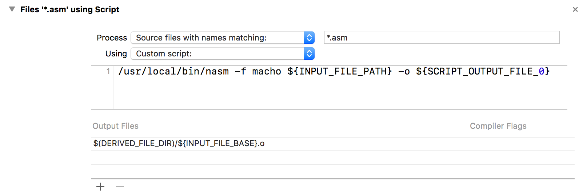

I was trying to build a compiler, as an assignment in Compiler Technology course in Beihang University.
I decided to use x86 as my destination code.
However there are 2 more steps to take before the x86 code can be executed.
Here is a what I have tried and I hope it will help you.

The assembly code has to be "assembled" first, with a tool called assembler.
There are many assemblers available, including GAS, NASM and MASM.
GAS is used by GNU GCC. NASM is cross-platform and MASM is exclusive to Windows.
I am using a MacBook Pro, so I have no choice but to use NASM.
Then because of the requirements of the assignment, I have to migrate it to Windows.

First I will talk about how I set up NASM and got Xcode to run and debug my assembly code.
Then I will talk about how to set up NAMS on Windows and use it to assemble x86 code to
object files on Windows.
In the end I will also tell you how to use a linker to make executable file on Windows.

First install NASM with `Homebrew`
```
$ brew install nasm
```
Then go to Build Rules in the Project Settings in Xcode, click the plus button,
and set the rules as below 
```
/usr/local/bin/nasm -f macho ${INPUT_FILE_PATH} -o ${SCRIPT_OUTPUT_FILE_0}
```
